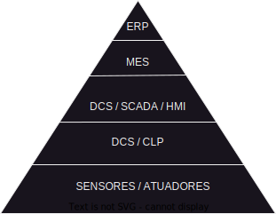

# Introdução

O objetivo desse projeto é integrar o que seriam o três primeiros 'niveis' convencionais da 'pirâmide de automação'.

  

A base da pirâmide, nível 1, será simulada por uma função transferência obtida empiricamente no laboratório de controle do IFES Serra. Usarei o [Node-red](https://nodered.org/about/) para implementar essa função transferência e simularei sensores e atuadores. Essa planta se conectará via socket ao nível 2, que será simulado por um PLC implementado utilizando [OpenPLC](https://openplcproject.com/docs/openplc-overview/). Por fim, o PLC se conectará à um sistema SCADA utilizando o protocolo Modbus I/P. O sistema utilizado será a distribuição gratuida do [Mango](https://github.com/MangoAutomation/ma-core-public#mango-automation-core-public-code-by-infinite-automation).

## Nível 1 — Planta de nível do laboratório de controle

Trata-se de um tanque de água que é descrito pela seguinte função de transferência no domínio da frequência:

$$ \frac{Y(s)}{U(s)} = \frac{0.9}{63s+ 1} $$

que no tempo pode será:

$$  y(t) = e^{\frac{-t}{63}} $$

Portanto, é um sistema simples de primeira ordem. Nós construiremos um ambiente através do Node-red que implementará a função e os objetos do laboratório — sensores e aturadores. 
